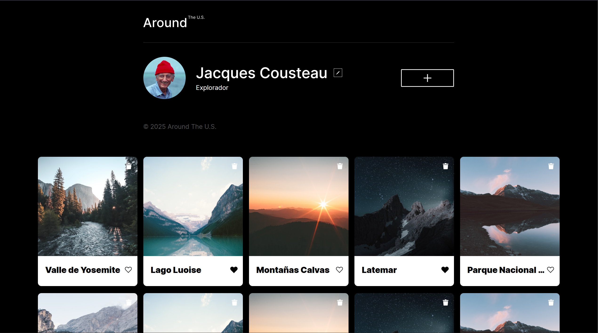

# Tripleten web_project_around_es

## Es una aplicacion interactiva similar a una red social donde puedes modificar tu perfil, dando un nombre y una breve descripción de ti, puedes agregar publicaciones, dandole un titulo corto de como te gustaria llamar esa publicacion y poner la imagen que quieres que se muestre, solo tienes que egragar la direccion de la imagen y aparece al final de las demas. Podras darle like a las publicaciones, tambien puedes eliminarlas, dandole click al icono de la basurita.

## Tecnologias:

- HTML5
- CSS3
- JavaScript
- Metodología BEM
- Diseño Responsivo
- Programación orientada a objetos
- JavaScript Modular

## Como se ve el proyecto

## Funcionalidades:

- Editar perfil del usuario
- Agregar nuevas tarejtas de lugares
- Dar "like" a las tarjetas/publicaciones
- Vista previa de imágenes en modal
- validación de formularios

## Enlace:

https://github.com/getzemani18/web_project_around_es.git
